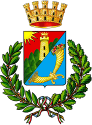

# CasertaTourApp
Caserta App for tourists in English, part of Udacity Android Nanodegree projects.

## About
Caserta App for tourists in English, part of Udacity Android Nanodegree projects. It provides basic info of the city, touristic places, hotels, restaurants and shopping places.

## Screnshots
  

